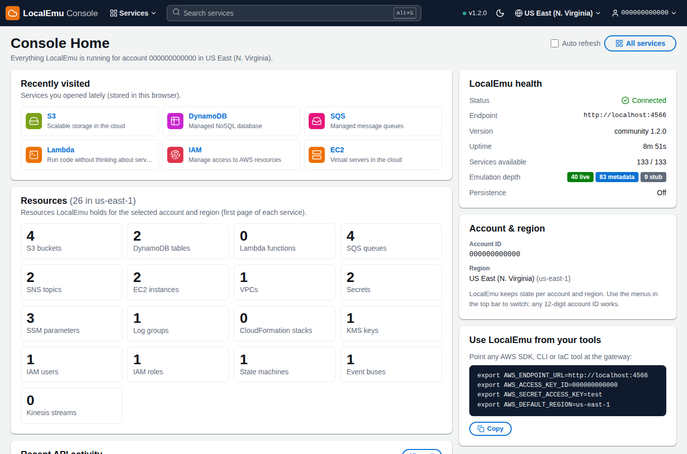
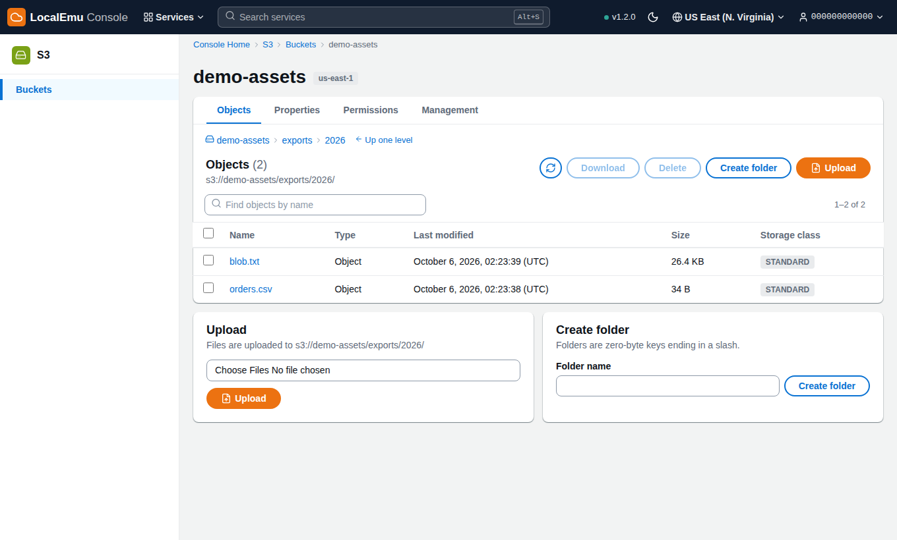
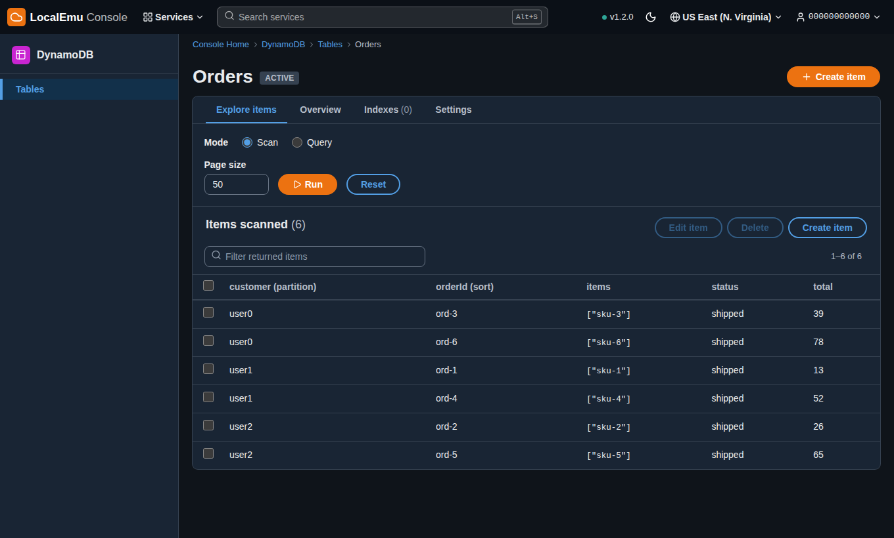
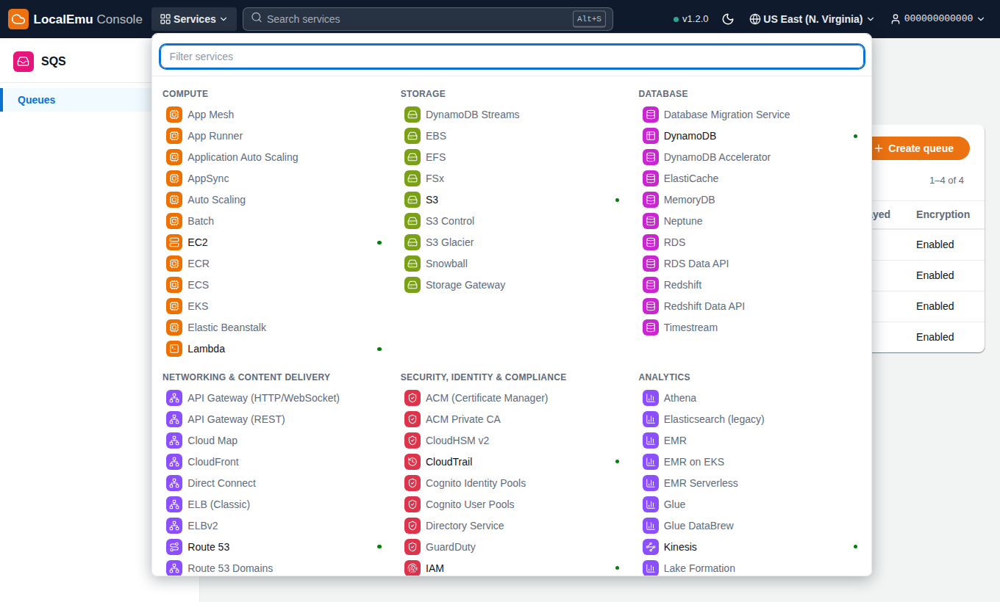

# LocalEmu Console

An AWS-console style web UI for [LocalEmu](../README.md): see everything that exists on your local
server and make changes from the browser, with the look and feel of the real console (top bar with a
Services menu, service side navigation, breadcrumbs, filterable tables with selection and an
**Actions** toolbar, confirmation dialogs, a flashbar, light and dark themes).

Built with **Astro 7** (server-rendered) and **Tailwind CSS 4**. No client-side framework: pages are
rendered on the server and every action is a plain form post, with a small script on top for
filtering, sorting, paging, menus and dialogs.

| | |
|---|---|
|  |  |
|  |  |

## Quick start

### With Docker Compose (next to LocalEmu)

From the repository root:

```bash
docker compose up --build
```

Console: <http://localhost:4321> · LocalEmu gateway: <http://localhost:4566>

### From source

You need Node.js 22.12 or newer and a running LocalEmu (`pip install localemu && localemu start`).

```bash
cd ui
npm ci
npm run dev                    # http://localhost:4321

# or a production build
npm run build && npm start
```

Shortcuts from the repository root: `make ui-dev`, `make ui-build`, `make ui-start`.

If LocalEmu is not on `http://localhost:4566`, set `LOCALEMU_ENDPOINT` (see below).

## What you can do

| Area | Capabilities |
|---|---|
| **Console Home** | Resource counts for the current account and region, LocalEmu health, recently visited services, recent API calls |
| **S3** | Create / empty / delete buckets; browse objects and folders; upload; download; view and edit text objects; pre-signed URLs; versioning, bucket policy, CORS; lifecycle and notification rules (read-only) |
| **DynamoDB** | Create / delete tables; scan and query (with sort-key conditions and index selection); create, edit and delete items as plain JSON or DynamoDB JSON; table overview and indexes |
| **SQS** | Standard and FIFO queues with dead-letter queue; send, poll (peek or consume) and delete messages; edit settings; purge; delete |
| **SNS** | Topics (standard / FIFO); subscriptions (SQS, Lambda, HTTP(S), email…); publish with attributes; delete |
| **Lambda** | Create from inline code or a zip; browse and edit code in the browser; deploy; test events with logs; configuration and environment; triggers; versions; layers |
| **EC2** | Launch, start, stop, reboot, terminate instances; AMIs; volumes and snapshots; security groups with rule editing; key pairs (private key shown once); Elastic IPs; VPCs, subnets, internet gateways, route tables |
| **IAM** | Users (access keys, groups), roles (trust policy presets), groups, customer and AWS managed policies (versions, attached entities), inline policies; cascade delete |
| **Secrets Manager** | Create, reveal on demand, new versions, recovery window or immediate deletion, restore |
| **Systems Manager** | Parameter Store with String / StringList / SecureString and history |
| **KMS** | Create keys with alias, enable / disable, schedule or cancel deletion, key policy, rotation, encrypt and decrypt |
| **CloudWatch** | Logs: groups, streams, filter-pattern search, live refresh, write test events, retention · Alarms · Metrics (list and publish) |
| **EventBridge** | Buses, rules (pattern or schedule), targets, send custom events |
| **Step Functions** | State machines, edit definition, start executions, execution history |
| **CloudFormation** | Create / update / delete stacks, outputs, resources, events, template |
| **Kinesis · Route 53** | Streams with put/read records · hosted zones and record sets |
| **CloudTrail** | Event history of every API call LocalEmu served, with request details |
| **Everything else** | All 130+ services get a tile in the Services menu; those without a purpose-built console open a generic read-only resource browser with their emulation tier (live / metadata / stub) and a getting-started command |

Handy details: **Alt+S** searches services, **/** focuses the table filter, the top bar switches
**region** and **account** (LocalEmu keeps separate state per account and region, so any 12-digit
number is a fresh account), and the moon icon toggles dark mode.

## Configuration

Environment variables of the console server:

| Variable | Default | Purpose |
|---|---|---|
| `LOCALEMU_ENDPOINT` | `http://localhost:4566` | Where the console *server* reaches LocalEmu |
| `LOCALEMU_PUBLIC_ENDPOINT` | same as above | How your *browser* reaches LocalEmu (used for pre-signed URLs and links) |
| `LOCALEMU_DEFAULT_REGION` | `us-east-1` | Region until you pick one in the top bar |
| `LOCALEMU_DEFAULT_ACCOUNT` | `000000000000` | Account until you pick one in the top bar |
| `HOST` / `PORT` | `localhost` / `4321` | Bind address of the production server (`npm start`) |

See [`.env.example`](.env.example).

### Dashboard API access

Home, Event history and the generic service pages read LocalEmu's own dashboard API
(`/_localemu/api/*`), which LocalEmu only serves to loopback callers. When the console runs in a
container (or on another host) start LocalEmu with `DASHBOARD_API_OPEN=1`; the provided
`docker-compose.yml` does this. Without it everything else still works, and those widgets explain
what is missing.

## How it works

```
Browser ──HTML / form posts──▶ Astro server ──AWS SDK v3 (SigV4)──▶ LocalEmu gateway :4566
```

* The console server talks to LocalEmu with the regular AWS SDK for JavaScript, so it exercises the
  same protocols as your own code. The selected account id is used as the access key id, which is
  how LocalEmu separates accounts.
* No CORS, no credentials in the browser, no API layer to keep in sync: pages call the SDK in their
  frontmatter and render the result.
* Mutations follow Post/Redirect/Get (`src/lib/action.ts`): a page declares handlers per `intent`,
  success becomes a flash message after a redirect, failure re-renders the page with the error and
  what you typed.
* `DataTable.astro` renders rows on the server; `src/scripts/console.ts` adds filtering, sorting,
  paging, row selection and action enabling on top. Buttons with `data-confirm` open the confirm
  dialog (optionally asking you to type a word first).

```
src/
  layouts/Console.astro        top bar, side nav, flashbar, confirm dialog
  components/                  DataTable, Card, Tabs, Details, FormField, PermissionsPanel …
  lib/                         aws.ts (SDK clients), action.ts (forms), services.ts (catalog), helpers per service
  pages/<service>/…            one folder per service console
  scripts/console.ts           progressive enhancement
  styles/global.css            design tokens (light/dark) and component classes
tests/e2e/                     Playwright flows that drive the real UI against a real LocalEmu
```

### Adding a service console

1. Add an entry to `CONSOLES` in `src/lib/services.ts` (name, icon, category, `href`, `nav`).
2. Create `src/pages/<service>/index.astro` with a `handlePost` block and a `DataTable`
   (copy `src/pages/sqs/index.astro` as a template), plus `create.astro` and a detail page.
3. Add an SDK client factory to `src/lib/aws.ts` and `npm i @aws-sdk/client-<service>`.

## Security notes

* **There is no login.** The console can do anything LocalEmu can, so keep it on loopback (the
  default for `npm run dev`, `npm start` and the compose file). Only change `HOST` deliberately.
* Cross-origin form posts are rejected (Astro `checkOrigin`), so other web pages can't drive the
  console through your browser.
* S3 downloads are served from a CSP sandbox and anything that isn't a plain image or text file is
  forced to download, so an uploaded HTML file can't run script on the console's origin.
* Secret values and decrypted parameters are only fetched when you ask for them.

## Known limitations

* Lambda updates, deletion and invocation need LocalEmu to reach a Docker daemon; without it
  functions end up in the `Failed` state and the console shows the reason.
* EC2 instances are API metadata unless LocalEmu has Docker (then each is a real container).
* Lists show the first page (up to a few hundred items) with client-side filtering and paging.
* Some detail is read-only here (S3 lifecycle and notifications, route tables, Lambda triggers);
  use the CLI, Terraform or CloudFormation for those.

## Development

```bash
npm run dev          # dev server with hot reload
npm run check        # type-check .astro and .ts files
npm run build        # production build into dist/ (self-contained, no node_modules needed)
npm run test:e2e     # browser tests, see below
```

### End-to-end tests

`tests/e2e` drives the real UI in Chromium against a real LocalEmu: every flow creates, changes and
deletes resources and asserts on what the page shows.

```bash
localemu start &                       # a throwaway instance
npm run dev &
npx playwright-core install chromium   # or: export CHROMIUM_PATH=/path/to/chrome
npm run test:e2e                       # all files; or: node tests/e2e/run.mjs dynamodb
```

Set `BASE=http://localhost:4400` to test a production server, and `E2E_LAMBDA=1` to include the
Lambda flow (needs Docker for LocalEmu).
